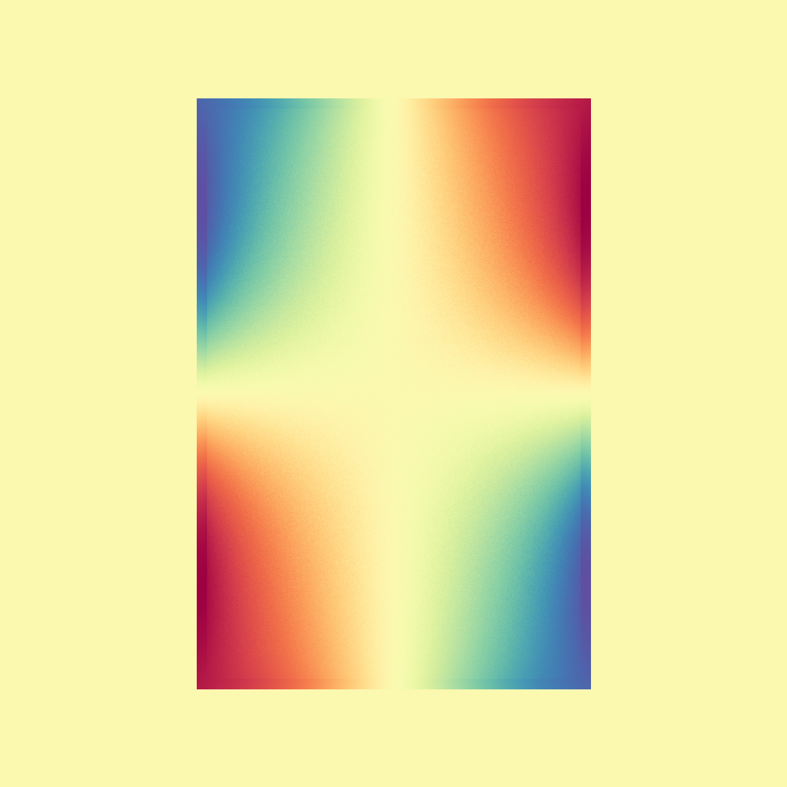
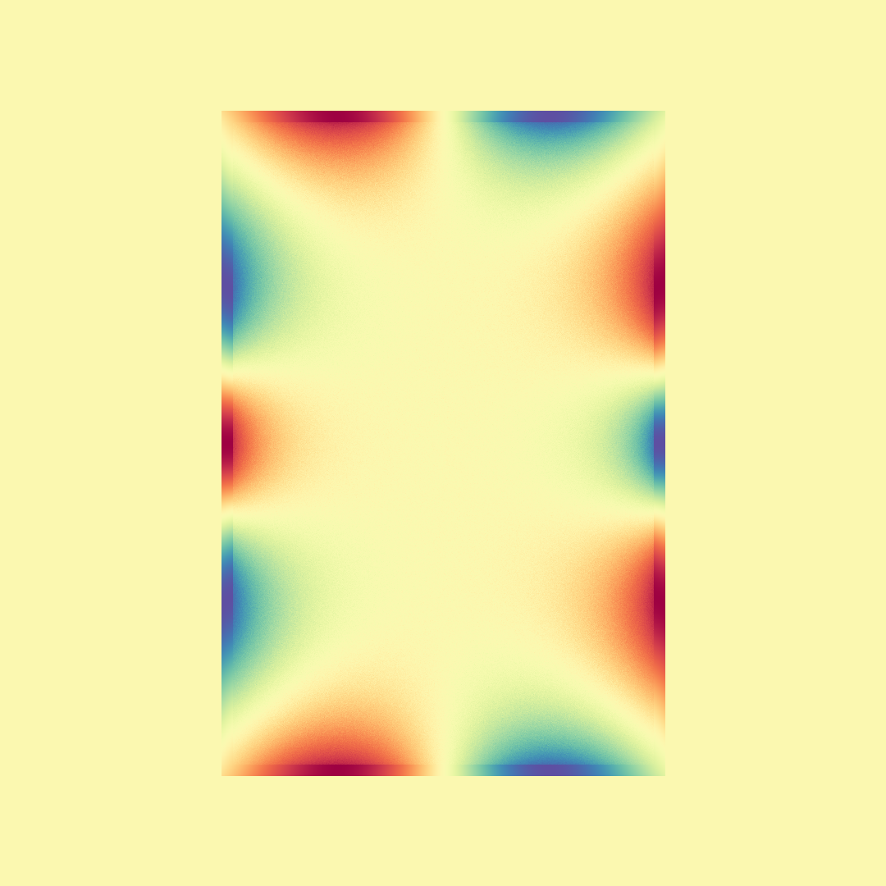
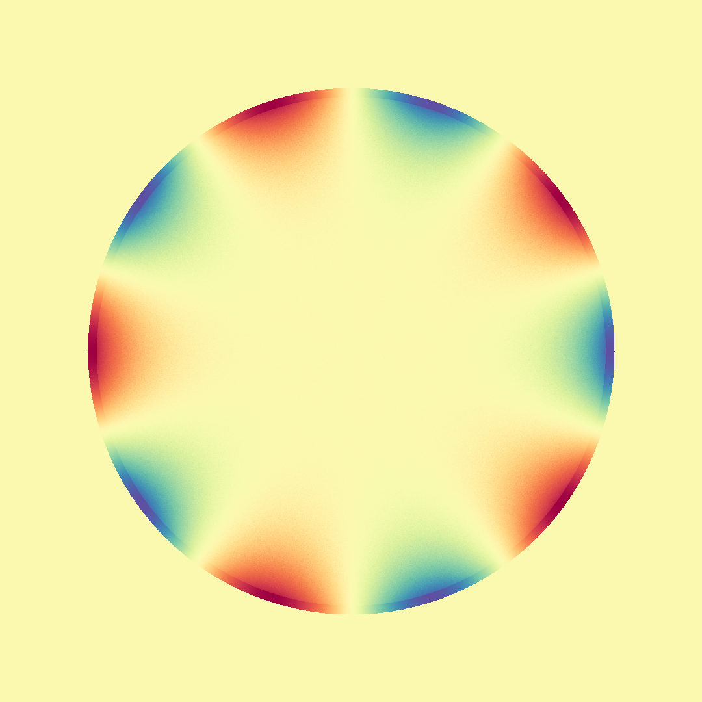

# Walk on Spheres
A basic implementation of the Walk on Spheres algorithm (in Rust!), introduced to computer graphics by Sawhney and Crane 2020 (and originally developed by Muller 1956). The algorithm can be used for solving linear partial differential equations using a Monte-Carlo method, with Dirichlet boundary conditions. 

Presently, the implementation is very simple, and can generate outputs like the following:

